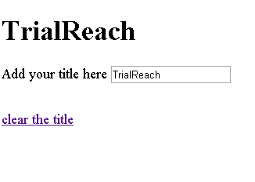

# JS challenge

## Task

Imagine that you have to build a framework that will be used by thousands of developers. Please implement the following features:

* templating
* event handling
* two-way binding implemented within the framework (bonus points if you finish with this one)

Please develop the features as separate modules (parts) of the framework.
You are not allowed to use any third party libraries like jQuery, lodash or underscore. No frameworks either.

The final result should look like this animated gif:



## Tests, tests, tests

Please do provide a good level of tests which covers your implementation.

Test at the level of granularity you think is more appropriate (e.g. unit, integration, e2e).

Feel free to use your favorite testing framework/setup.

**A test submission withut tests is considered as not passing the minimal requirements.**

## The base

Here is the HTML file that you will start from:

```html
<!DOCTYPE html>
<html>
  <head>
    <script src="Framework.js"></script>
  </head>
  <body>

    <div class="content"></div>

    <script type="template/framework" id="header-template">
      <header>
        <h1>{{title}}</h1>
        <form>
          <label for="title">Add your title here</label>
          <input type="text" id="title" data-event="keyup:titleChanged" value="{{title}}" />
        </form>
        <a href="#" data-event="click:clearTitle">clear the title</a>
      </header>
    </script>

    <script>

      var header = Framework.create({
        template: '#header-template',
        data: {
          title: 'TrialReach'
        },
        clearTitle: function(e) {
          document.querySelector('input').value = '';
          document.querySelector('h1').innerHTML = '';
        },
        titleChanged: function(e) {
          document.querySelector('h1').innerHTML = e.target.value;
        }
      });
      header.render('.content');

    </script>
  </body>
</html>
```

Please do not change the content of `index.html` (the base). The idea is for you to fill the content of `Framework.js` (currently an empty file) and make the things work without touching the code in the script tags.

### Templating

The HTML template is placed in a script tag. You should fetch the markup from there based on the `id`. Your framework should has only one public method called `create`. It should accept an object literal with the following characteristics:

* `data` - all the properties of this object may be used in the template in the format of `{{property name}}`
* custom functions - functions that will be called in a response of DOM events

### Event handling

The events that we are interested in should be described in `data-event` attributes. The format is `eventname:customfunction`. 

## Submission

Include a file named RATIONALE.md in your source code containing notes on design choices you made in solving the problem, and what you might have done to improve the program for real-world use given more time.

Do provide any instruction needed to run/build the project (if needed).

## Notes

* This exercise should take about 90 minutes, 2 hours at the most. Please don't spend too long on it. Tell us how long you spent, and if you run out of time then please send notes on what you would have done given more time
* Don't worry too much about edge cases. We want to see how you think, how you construct your JavaScript applications. If your demo behaves like on the animated gif above we are happy.
* Don't worry about browser specific issues. Make sure that your demo works in Chrome.

